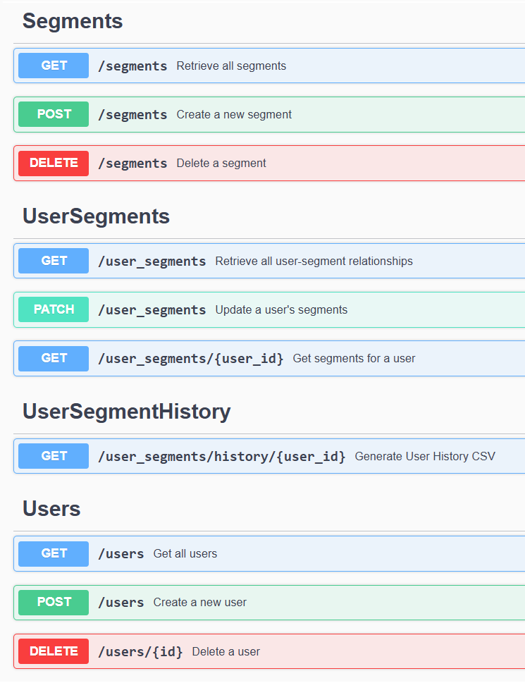

# Golang REST API для управления группами пользователей

🔧 **Полный список технологий, используемых в проекте**:

- **Echo** – Веб-фреймворк для создания REST API.
- **sql** – Работа с базами данных на уровне драйвера.
- [**PostgreSQL**](https://www.postgresql.org/) – Реляционная база данных.
- [**Docker**](https://www.docker.com/) – Контейнеризация для удобного деплоя приложения.
- [**Swagger**](https://swagger.io/) – Генерация документации API.
- [**Testify**](https://github.com/stretchr/testify) – Набор инструментов для написания тестов.
- [**gomock**](https://github.com/golang/mock) – Фреймворк для создания моков в Go.
- [**Kafka**](https://kafka.apache.org/) – Брокер сообщений для асинхронной обработки событий.
- [**pq**](https://github.com/lib/pq) – Быстрый и современный драйвер для работы с PostgreSQL.
## Описание


Dynamic User Groups API — это REST API для управления пользовательскими группами. Этот сервис предоставляет:

- Добавление и удаление пользователей в группы.

- Установку временных ограничений (`TTL`) для членства в группе.

- Отслеживание истории изменений пользовательских групп.

- Генерацию отчетов в формате CSV.

- Интуитивную документацию через Swagger UI.

- Добавление пользователей в группы.

- Удаление пользователей из групп.

- Удаление групп по истечению `TTL`.

- Вывод истории изменений групп в формате CSV.

- API с документация Swagger.

---
## Установка

### 1. Клонирование репозитория

```
$ git clone https://github.com/Artorison/Dynamic-User-Groups-API.git
$ cd dynamic-user-groups-api
```

### 2. Настройка конфигурации

1. Скопируйте пример файла конфигурации: 

2. Откройте `config/config.yml` и настройте параметры подключения (если необходимо):

```yaml
database:
  host: "localhost"
  port: "5444"
  user: "postgres"
  password: "12345"
  dbname: "postgres"

http_server:
  address: "localhost:8080"
  timeout: 4s
  idle_timeout: 59s

kafka:
  brokers:
    - "localhost:9092"
  topic: "user-segments"
```

---
## 3. Запуск через Docker

### Команды Makefile

Для управления проектом доступны команды `Makefile`. Основные:

```
$ make help  # Показать список всех доступных команд
$ make pull  # Скачать необходимые образы Docker
$ make build # Собрать образы проекта
$ make up    # Запустить проект в контейнерах
$ make down  # Остановить и удалить контейнеры
$ make start # Запустить все контейнеры
$ make stop  # Остановить все контейнеры
```

### Полный запуск через Docker

* Скачать образы, собрать и запустить проект:
```
$ make pull
$ make build
$ make up
```

- Или с помощью команды
   ```bash
   docker-compose up --build
   ```
---
##  Структура проекта


```bash
├── cmd/user_groups_api/
│       └── main.go         
├── config/
│   └── config.yml
├── csv_reports/         
├── docs/
│   └── images/
├── internal/
│   ├── app/
│   │   ├── app.go
│   │   ├── di.go
│   │   ├── middleware.go
│   │   └── routes.go
│   ├── config/
│   │   └── config.go
│   ├── database/
│   │   └── database.go
│   ├── handlers/
│   │   ├── segment_handler.go
│   │   ├── us_seg_history_handler.go
│   │   ├── user_handler.go
│   │   └── user_segment_handler.go
│   ├── kafka/
│   │   ├── config.go
│   │   ├── consumer.go
│   │   └── producer.go
│   ├── models/
│   │   ├── response.go
│   │   ├── response_test.go
│   │   ├── segment.go
│   │   ├── us_seg_history.go
│   │   ├── user.go
│   │   └── user_seg.go
│   ├── repository/
│   │   ├── mocks/
│   │   ├── segment_repo.go
│   │   ├── user_repo.go
│   │   ├── user_seg_repo.go
│   │   └── user_segment_history.go
│   ├── services/
│   │   ├── mocks/
│   │   ├── segment_service.go
│   │   ├── us_seg_history_service.go
│   │   ├── user_segments.go
│   │   └── user_service.go
│   └── utils/
│       └── time.go
├── migrations/
├── docker-compose.yml
├── Dockerfile
├── go.mod
├── go.sum
├── Makefile
```

## API
#### Swagger-документация

Swagger UI доступен по адресу:

```url
https://artorison.github.io/Dynamic-User-Groups-API/
```

После запуска приложения доступна Swagger UI c возможностью взаимодействия с API:

```url
http://localhost:8080/swagger/index.html
```


### Добавление сегментов для пользователя

  

**`POST /user_segments`**

  

```

{
    "add_segments": ["DISCOUNT_30"],
    "delete_segments": ["DISCOUNT_50"],
    "user_id": 1000,
    "ttl": "2024-12-31T23:59:59Z"
}

```

  

Ответ:

```
{
    "status": "success",
    "message": "Segments updated successfully"
}
```

  

---

  

### История изменений

**`GET /user_segments/history/{user_id}`**

Параметры:

- **`user_id`**: ID пользователя.

Пример ответа (CSV):

```
user_id,segment_slug,operation_type,operation_date
1000,DISCOUNT_30,add,2024-01-01T12:00:00Z
1000,DISCOUNT_50,delete,2024-01-01T13:00:00Z
```


---

  
## Тестирование

- Запустить тесты проекта:
    

```
$ make test
```
---


## Лицензия

Проект доступен под лицензией MIT. Подробнее см. в файле `LICENSE`.
